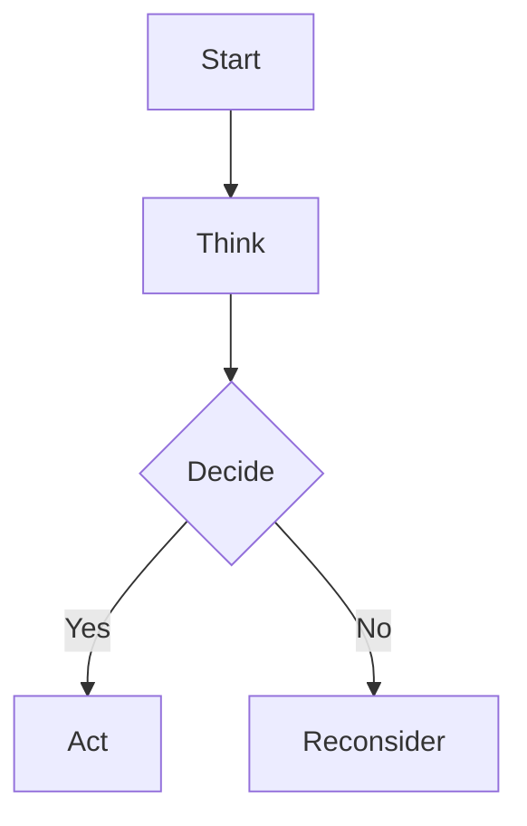

# Welcome to My Knowledge Base

This is a quick test of Markdown + Mermaid + images.

## Mermaid Diagram

```mermaid
graph TD
  A[Start] --> B[Think]
  B --> C{Decide}
  C -->|Yes| D[Act]
  C -->|No| E[Reconsider]
```

